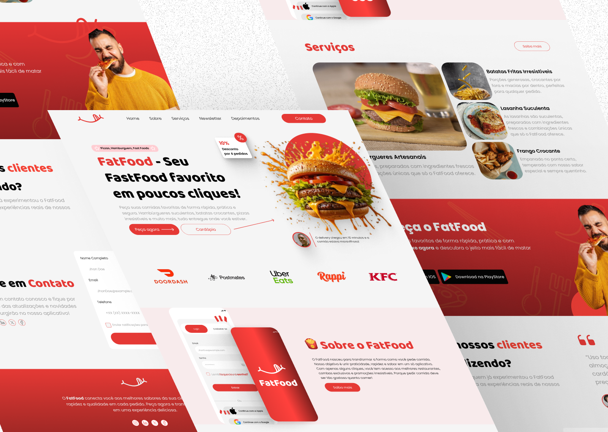

# 🍔 FatFood - Seu FastFood Favorito



---

## 📌 Descrição do Projeto

O **FatFood** é um site de fast-food desenvolvido para fornecer uma experiência rápida, intuitiva e visualmente atraente. O objetivo é permitir que os usuários conheçam os produtos, façam pedidos e interajam com a marca de forma simples e prática.

O design do projeto foi criado no **Figma** e o desenvolvimento seguiu as boas práticas de **Next.js**, **TypeScript** e **Tailwind CSS**, garantindo performance, responsividade e escalabilidade.

---

## 🎨 Design

O projeto foi planejado com foco em **UI/UX**, utilizando cores vibrantes, tipografia moderna e elementos interativos para criar uma experiência agradável ao usuário.

- **Figma Link:** [Acessar Design](https://www.figma.com/design/9qKB44W6DqNjgNU4JI99XZ/FatFood---App?node-id=0-1&t=kV43vyE4KfsWbzOJ-1)

---

## ⚡ Tecnologias Utilizadas

- **Next.js** – Framework React moderno, otimizado para performance e SEO  
- **TypeScript** – Tipagem estática para maior segurança e manutenibilidade  
- **Tailwind CSS** – Framework utilitário para estilização rápida e responsiva  
- **React Icons / Lucide-react** – Biblioteca de ícones moderna e leve  
- **Vercel** – Deploy e hospedagem do projeto  

---

## 📂 Estrutura do Projeto

```plaintext
fatfood/
│
├─ public/              # Imagens, logos e assets estáticos
├─ src/
│   ├─ app/             # Pages e rotas do Next.js
│   ├─ components/      # Componentes reutilizáveis (Navbar, Footer, Hero, etc)
│   ├─ data/            # Dados estáticos (cards, testimonials, menu)
│   └─ styles/          # Estilos globais e variáveis Tailwind
├─ package.json
├─ tailwind.config.js
├─ tsconfig.json
└─ README.md

---

```

Deploy Vercel: <a href="https://fat-food-landing-page.vercel.app/" >Clique aqui!<a/>


<h1>EN<h1/>

## 📌 Project Description

FatFood is a fast-food website designed to provide a fast, intuitive, and visually appealing experience. The goal is to allow users to learn about products, place orders, and interact with the brand in a simple and practical way.

The project was designed in Figma, and development followed best practices in Next.js, TypeScript, and Tailwind CSS, ensuring performance, responsiveness, and scalability.

---
## 🎨 Design

The project was designed with a focus on UI/UX, utilizing vibrant colors, modern typography, and interactive elements to create a pleasant user experience.

- **Figma Link:** [Access Design](https://www.figma.com/design/9qKB44W6DqNjgNU4JI99XZ/FatFood---App?node-id=0-1&t=kV43vyE4KfsWbzOJ-1)

---

## ⚡ Technologies Used

- **Next.js** – Modern React framework, optimized for performance and SEO
- **TypeScript** – Static typing for greater security and maintainability
- **Tailwind CSS** – Utility framework for fast and responsive styling
- **React Icons / Lucide-react** – Modern and lightweight icon library
- **Vercel** – Project deployment and hosting

---

## 📂 Project Structure

```plaintext
fatfood/
│
├─ public/ # Images, logos, and static assets
├─ src/
│ ├─ app/ # Next.js pages and routes
│ ├─ components/ # Reusable components (Navbar, Footer, Hero, etc.)
│ ├─ data/ # Static data (cards, testimonials, menu)
│ └─ styles/ # Global styles and Tailwind variables
├─ package.json
├─ tailwind.config.js
├─ tsconfig.json
└─ README.md

---
```

Deploy Vercel: <a href="https://fat-food-landing-page.vercel.app/">Click here!<a/>